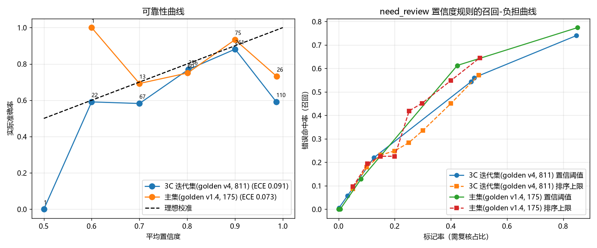

# 2.6 置信度校准 Spike（2026-08-17）

> 目的：量化"模型置信度与真实正确率"的偏离程度，回答两个问题——
> ① 置信度这把尺子偏多少、错在哪；② 校准/规则调整后 need_review 能救回多少错误。
> 数据：need_review 回测缓存预测（v11 代码态）——3C golden v4（717 可评分）、
> 主集 golden v1.4（175 可评分）。全程离线，不耗 LLM、不碰 hold-out。

## 1. 可靠性曲线（置信度分桶 vs 实际准确率）

| 置信度桶 | 3C 条数 | 3C 实际准确率 | 主集条数 | 主集实际准确率 |
|---|---|---|---|---|
| 0.50~0.60 | 1 | 0% | 0 | — |
| 0.60~0.70 | 22 | 59% | 1 | 100% |
| 0.70~0.80 | 67 | **58%** | 13 | 69% |
| 0.80~0.90 | 256 | 77% | 60 | 75% |
| 0.90~0.95 | 261 | 88% | 75 | 93% |
| 0.95~1.00 | 110 | **59%** | 26 | 73% |

- ECE（期望校准误差）：3C **0.091**、主集 **0.073**（理想≈0）。
- 最反常的是**最高置信桶（0.95+）准确率暴跌**——平均报 98.6% 可信，实际只有 59%。

## 2. 根因：词典直判的置信度不可信（LLM 置信度其实还行）

| 来源 | 3C 条数 | 错误率 | 主集条数 | 错误率 |
|---|---|---|---|---|
| 词典直判（lexicon conf≥0.8，未送 LLM） | 104（15%） | **49%** | 24（14%） | 33% |
| LLM 精分析 | 613（85%） | 20% | 151（86%） | 15% |

- 置信≥0.95 桶内：3C 词典直判 92 条错 44（48%），LLM 18 条只错 1（6%）。
- **词典直判只占 15% 条数，却贡献 29% 的错误（3C 51/173）**。

## 3. 对 need_review 的影响（召回 × 标记负担）

| 规则 | 3C 召回 | 3C 标记率 | 主集召回 | 主集标记率 |
|---|---|---|---|---|
| v1 旧（conf<0.5+反讽） | 2.3% | 2.4% | 0% | 1.1% |
| v2 现有（conf<0.7+问句/短句/黑话/反讽） | 30.6% | 28.3% | 3.2% | 16.6% |
| **仅标词典直判** | 29.5% | **14.5%** | 25.8% | **13.7%** |
| **v2 + 词典直判** | **50.9%** | 39.9% | 25.8% | 29.1% |

- 按置信排序的"完美校准上限"：3C 标 30% 最多召回 34%、标 50% 召回 57%——
  单靠置信度有结构性天花板（错误并不集中在低置信）。
- 词典直判信号与文本信号互补：3C 组合后召回 50.9%（v2 翻倍余），主集召回
  25.8%（v2 的 8 倍）。
- 主集上 v2 的问句/短句信号只增加负担不加召回（25.8%/13.7% 优于 25.8%/29.1%）——
  建议**按领域分权**：直判全领域必标；问句/短句等文本信号仅 3C 保留。

## 4. 跨域 binning 校准（训练→测试）

- 3C→主集：ECE 0.073→0.053；主集→3C：ECE 0.091→0.074。改善有限（-0.02 级），
  说明校准不能跨域复用，正式方案需**按领域在自己的 golden 上拟合**。

## 5. 结论与建议

1. **"置信度标定问题"的实锤**：偏差几乎全部来自词典直判路径——词典置信度饱和在
   0.98 附近但准确率仅 50~70%；LLM 置信度（0.9+ 桶 88~94%）相对可信。
2. **need_review v3（低风险，建议立即做）**：词典直判必标 + 文本信号按领域分权
   （3C 保留 v2 信号；主集/边界集只留低置信+反讽+黑话+直判）。
   预计 3C 召回 50.9%、主集 25.8%，成本仅标记率上升。
3. **路由阈值候选（提准类，需走验证纪律）**：把 3C 词典直判样本送 LLM
   （+15% LLM 调用，费用仍低），若 LLM 错误率从 49% 降到 20%，理论可回收
   ~30+ 条错误（≈+3~4pp）——这是目前看到的最强提准杠杆，建议作为下个候选
   在迭代集验证（2 轮取均值），通过后再考虑 r4 第 2 发。
4. **报告展示**：词典直判项的高置信度会误导用户，应改为标注"词典直判"或给出
   校准后估计（约 0.5~0.7），至少不要显示 0.98。
