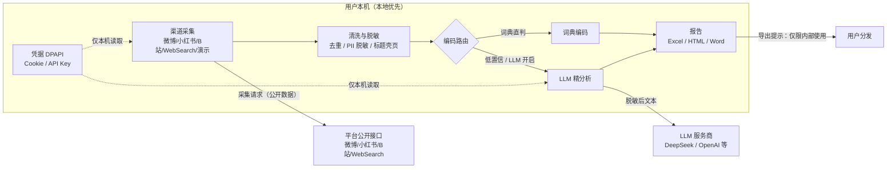

# 商业需求文档（BRD，含市场需求）

> 版本：v1.1（2026-08-22）| 状态：待评审
> 配套：[PRD](PRD.md) · [技术方案](技术方案.md) · 运营增长方案（私有） · [决策日志](决策日志.md)
> 说明：v1.1 将原 MRD 的市场需求内容并入本文档（§3~§6），原 `MRD.md` 已删除。

## 1. 项目背景与问题

- **需求真实存在**：品牌方、产品经理、个人创作者都需要知道"用户在社交媒体上怎么评价我"，用于新品口碑评估、竞品对比、热点复盘。
- **现状痛点**：
  - 商业舆情 SaaS 门槛高：年费数万至数十万元、需商务报价、面向企业采购，个人和小团队用不起；
  - 人工方案不可持续：手动搜索 + Excel 整理，耗时且主观；
  - 数据与隐私顾虑：云端 SaaS 需上传账号凭据/内容，敏感用户顾虑大；
  - 质量不透明：多数工具不公布准确率，结论不可追溯。
- **机会窗口**：LLM 让"小规模、低成本、高质量"文本分析成为可能（本产品单任务 LLM 费用约 ¥0.3~1）；本地优先 + BYOK（自带 Key）可同时解决成本与隐私两个痛点。

## 2. 项目目标

### 2.1 双层目标

| 层 | 目标 | 出口标准 |
|---|---|---|
| 当前（作品集阶段） | 完成开箱即用、质量可证明的**单次分析工具** | 单次分析闭环完整；无 Key 用户可先看演示报告 |
| 远期（商业化） | 网页直接使用（本地采集 + 云端分析） | 3 次免费体验 → 订阅制闭环（见 网页版演进路线图（私有）） |

### 2.2 指标体系（分层）

**北极星（远期商业化）**：每周成功产出并下载的分析报告数——持续价值实现；质量护栏 = 黄金集准确率不跌破基线（防"产出垃圾报告"充数）。

| 层级 | 指标 | 说明 |
|---|---|---|
| 北极星 | 每周成功产出并下载的分析报告数 | 持续价值；远期（需账号 + 埋点） |
| 激活 | 首次成功产出报告 | 漏斗起点 |
| 留存 | 30 天内再次分析 | 单次工具的复购信号 |
| 转化 | 3 次免费用尽后订阅 | 远期 |

**当前（作品集）阶段**：无埋点、无账号，北极星用替代信号——内测激活率、GitHub 公开后的 star/issue、演示报告使用。

**辅助指标**：采集成功率/丢弃率、黄金集准确率、单任务 LLM 费用、任务完成率。

### 2.3 当前不做什么

持续监控/告警/多期对比（3.1~3.4）、打包分发、网页版、抖音渠道——均已明确延后（2026-08-20 定位收敛，见 [决策日志](决策日志.md)）。

## 3. 目标用户与使用场景

### 3.1 用户画像

| 画像 | 特征 | 核心诉求 | 付费意愿 |
|---|---|---|---|
| 个人创作者/博主 | 需要了解粉丝与平台口碑，预算低 | 便宜、简单、单次够用 | 低-中 |
| 小团队/初创（3~10 人） | 做新品/竞品调研，无专职舆情岗 | 快速出报告、可导出、成本可控 | 中 |
| 品牌方市场人员 | 日常/专项舆情分析 | 可信、可追溯、合规 | 中-高（远期） |

> 画像当前基于项目场景假设，**待 5~10 人内测访谈回填**。

### 3.2 Job-to-be-done

- 新品发布后：知道用户主要在夸/骂哪些维度；
- 品牌卷入事件时：快速抓取讨论、判断情感与责任；
- 日常：观察声量与负面率有无突变（远期）。

### 3.3 使用场景

| 场景 | 用户故事 | 当前覆盖 |
|---|---|---|
| A. 日常品牌事件监控和归因 | 品牌运营每天看讨论量/负面率有无突变 | 不覆盖（3.2/3.3 延后） |
| B. 新品口碑评估 | 产品经理在新品发布后做一次完整评估 | ✅ 覆盖（单次分析） |
| C. 热点事件复盘和归因 | 品牌卷入热点后快速抓取讨论、还原时间线 | 部分覆盖（单次抓取与归因；热榜感知延后） |

### 3.4 主旅程（当前）

输入品牌/关键词 → 向导 6 步 → 后台任务 → 结果页（结论/图表/下载）→ 导出 Excel/HTML/Word 报告。

产品定位一句话（2026-08-20）：**小白也能上手的本地桌面级单次社交媒体情感分析工具——输入品牌/关键词 → 输出可分享的图表与分析报告。**

## 4. 市场分析

### 4.1 市场规模

- **中国舆情监测系统市场**：2024 年规模约 110 亿元，2020-2024 复合增速约 18%，预计 2025-2030 年维持 15% 以上年增速（来源：蚁坊软件公开行业分析，2025-07；**竞品厂商口径，待第二来源复核**）。
- **全球社交聆听市场**：Grand View Research 预计 2024-2030 年复合增速约 14%（该口径偏窄，仅作趋势参考）。

### 4.2 趋势与空白地带

- 社交媒体/短视频/问答社区成为品牌口碑主战场，"舆情分析"从政府/大企业向中小企业与个人下沉；
- LLM 降低文本分析成本与门槛，轻量自助工具出现机会；
- 数据隐私关注上升，"本地处理/可控出境"成为差异化卖点；
- **空白地带**：现有厂商集中在"企业年费制"（数万~上百万/年），个人、小团队、独立开发者缺少低成本自助工具。

## 5. 竞品分析

### 5.1 直接竞品（价格锚点，2026-08 二手资料）

| 厂商 | 定位 | 定价锚点 | 门槛 |
|---|---|---|---|
| 清博智能 | AI+舆情综合平台（政务/央国企/500 强） | 未公开，项目级数十万常见 | 企业采购 |
| 识微科技（识微商情） | 企业商情 SaaS（快消/零售/电商） | 基础套餐数万元/年起，分层报价 | 中小企业起 |
| 微舆情 / 蚁坊 / 乐思等 | 聚合舆情 / 政企本地化 | SaaS 数万~私有化上百万 | 政企/企业 |
| Brandwatch（海外） | 企业级消费者洞察 | 约 $800~2,000/月，自定义报价 | 企业 |
| Meltwater（海外） | 媒体+社交监测 | 约 $15,000/年起，12 个月起约 | 企业 |
| Talkwalker（海外） | 视觉 AI + 多语言监听 | 约 $9,000/年起 | 企业 |
| Sprout Social（海外） | 社媒管理+监听加购 | $199~399/座席/月，监听加购 $999/月 | 团队 |

共同特征：企业向、商务报价、年约、无自助轻量档——**个人/小团队/自助场景是空白**。

### 5.2 间接替代

- 手动搜索 + Excel：零成本但耗时主观；
- 社交平台自带数据（如微博热搜）：单平台、无情感维度；
- 通用 AI 聊天（把文本粘给 LLM）：无采集、无报告、无批量。

### 5.3 差异化定位与护城河

- **本地优先**：数据与凭据不出本机；LLM 开启时发送文本且先脱敏；
- **BYOK**：用户自带 LLM Key，成本自控（单任务 ¥0.3~1）；
- **词典兜底免费**：无 Key 也能完整跑通；
- **开箱即用**：5 分钟出报告，内置演示报告；
- **质量可证明**：公开准确率口径（整条情感准确率 + 样本量，取自 `tests/fixtures` 冻结基线 2026-08-21：词典直判 主集 **50.9%**（n=175）；大模型精分析模式〔评测口径：混合流水线〕主集 **86.9%**（n=175）、边界集 **87.5%**（n=220））+ 黄金集评测 + 证据链；
- **护城河**：质量评测体系（黄金集 + 基线门槛 + 证据链）是同类轻量工具普遍不具备的"可证明的准确率"。

一句话差异化：**"个人和小团队用得起、信得过、看得懂"的轻量舆情分析工具。**

## 6. 需求优先级

| 优先级 | 需求 | 来源 |
|---|---|---|
| P0 | 单次分析闭环（向导→采集→编码→报告） | 阶段 0~3 已实现 |
| P0 | 质量可证明（黄金集/回归/证据链） | 阶段 2 已实现 |
| P1 | 渠道能力（B站/WebSearch/微博/小红书/演示） | 阶段 1/2 已实现 |
| P1 | 隐私合规（脱敏/确认页/一键清除） | P1-1~P1-8 已实现 |
| P2 | 埋点与数据分析（激活/转化漏斗） | **新增，待排期** |
| P2 | 用户反馈闭环数据化 | 已有反馈功能，待埋点接入 |
| 远期 | 网页版/订阅/定时监控 | 延后清单 |

## 7. 商业模式

| 档位 | LLM 由谁出 | 内容 | 状态 |
|---|---|---|---|
| 体验 | 运营方（限 3 次） | 全功能跑通，规模封顶，成功产出才计数 | 远期设计 |
| 基础订阅（BYOK） | 用户自带 | 无限任务、历史存储、全部渠道、可选记住 Key | 远期设计 |
| 专业订阅 | 运营方 | 更大配额、团队子账号、优先支持 | 远期设计 |

- **定价假设（待内测校准）**：基础 ¥39~69/月 或 ¥299~499/年；专业 ¥99~199/月（源自网页版演进路线图 2026-08-10）。
- **成本结构**：本地版无服务器成本，仅 LLM 调用（单任务 ¥0.3~1）；远期网页版增加服务器/存储/邮件/支付摊销。
- **盈利逻辑**：基础档毛利 = 订阅收入 − 存储/通道费（LLM 由用户出）；专业档毛利 = 订阅收入 − LLM 成本，需以任务频率控制成本。

> **形态矛盾（显式声明）**：单次工具天然低复购，订阅制依赖远期高频形态（定时监控 / 系列分析 / 历史对比）。当前作品集阶段以"单次可信输出"为核心；商业化桥接路径见 运营增长方案（私有） §4。

## 8. 范围与里程碑

| 里程碑 | 内容 | 状态 |
|---|---|---|
| M0 | 本地单次分析工具闭环（阶段 0~3） | ✅ 已完成（2026-08） |
| M1 | 应用完善 + GitHub 公开（README 小白向 + CI 绿 + 演示报告） | 延后至应用完善后 |
| M2 | 网页版步骤 1：云端服务端化（登录/用户库/公共渠道） | 远期 |
| M3 | 步骤 2：浏览器扩展微博采集；步骤 3：商业化闭环 | 远期 |
| M4 | 规模化：扩展商店、小红书、团队子账号 | 远期 |

外部依赖（影响 M2+ 时间线，建议提前启动）：ICP 备案、支付主体、Chrome 商店审核。

## 9. 风险与合规

| 风险 | 应对 |
|---|---|
| 平台风控与渠道失效（微博/小红书） | 公共渠道兜底（B站/WebSearch/demo）、风控冷却、报告诚实标注采集局限 |
| 内容合规（个保法、平台条款） | 使用边界确认、LLM 调用前脱敏、一键清除、导出合规提示（P1-1~P1-8 已落地） |
| AGPL-3.0 与商用的冲突 | 公开/商业化前决策：换证、双授权或开源引流 |
| 商业化外部周期（备案、支付主体） | 提前启动，不阻塞本地版与作品集展示 |
| 作品集阶段 | 无商业风险，重点是"可信展示"：准确率明示 + 演示报告 + 证据链 |

**合规数据流图**（数据去向：哪些在本机、哪些出网）：

> 出网点有两类：① 采集请求 → 平台公开接口（仅公开数据；凭据只在本机携带，不外传）；② LLM 调用 → 服务商（脱敏后的文本，可关闭 LLM 完全避免）。一键清除覆盖采集数据/报告/凭据（P1-4）。

## 10. 资源与预算

- 当前：单人开发，无服务器成本；少量 LLM 评测费用。
- 远期：服务器/存储/邮件/支付摊销 + LLM 成本；定价 = 成本地板×3~5 + 竞品锚点修正（网页版演进路线图口径）。
- 盈亏平衡：以基础 ¥39/月估算，覆盖存储+通道成本所需的订阅数待定价校准后回填。

## 11. 数据来源与待办

- 市场数据：蚁坊软件（2025-07）、Grand View Research（2026-08 检索）；竞品定价来自公开二手资料（Vendr/SocialRails/ITQlick/Mention，2025-2026），仅作锚点，实际以厂商报价为准。
- 待办：5~10 个真实用户内测回填画像与转化数据（见 内测方案（私有））；定价内测校准（见 定价测算表（私有））；产品埋点落地（PRD F9-1，见 埋点方案（私有））；市场规模数字待独立来源交叉复核。
