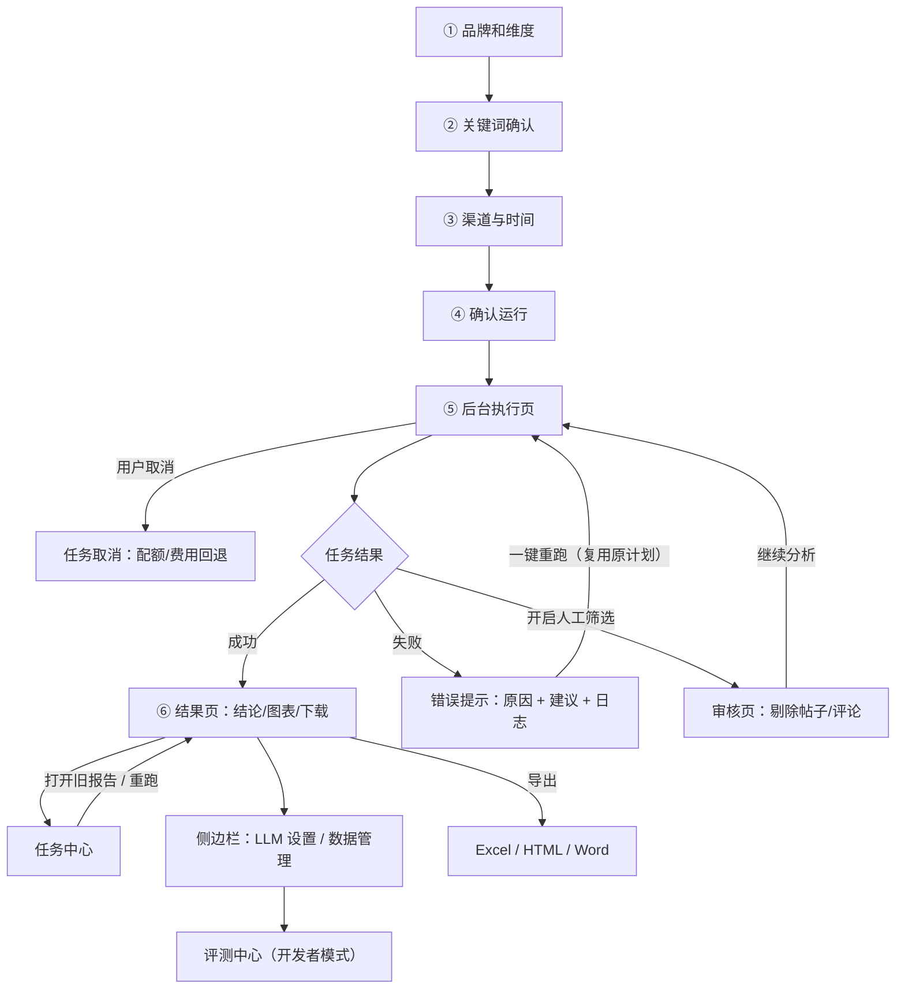
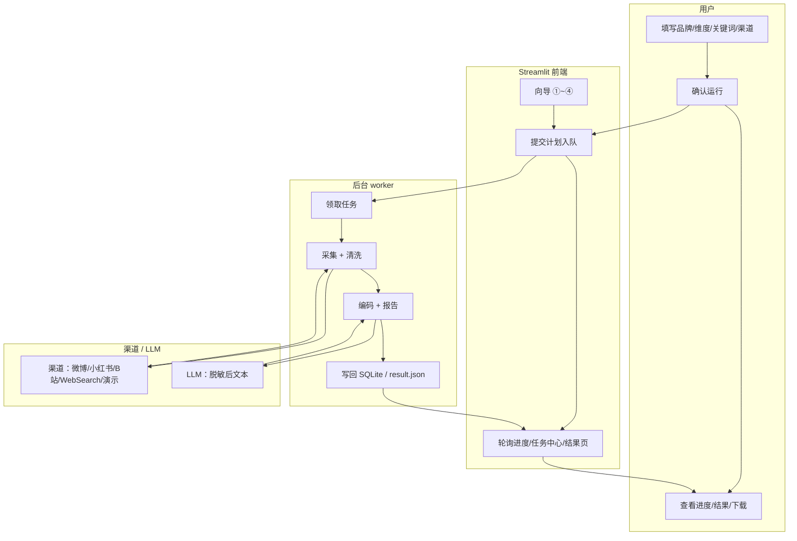

# 产品需求文档（PRD）

> 版本：v1.0（2026-08-22）| 状态：待评审
> 配套：[BRD](BRD.md) · [技术方案](技术方案.md) · [项目方案](项目方案.md) · [决策日志](决策日志.md)
> 说明：本文件为"做什么/怎么验收"的单一入口；实现细节见技术方案，历史决策见决策日志。

## 1. 产品概述与范围

**定位一句话**：小白也能上手的本地桌面级**单次**社交媒体情感分析工具——输入品牌/关键词 → 输出可分享的图表与分析报告。

**当前范围**：单次分析闭环（采集 → 清洗 → 编码 → 报告）+ 后台任务 + 数据管理 + 评测中心。
**不纳入当前范围**：持续监控/告警/多期对比（3.1~3.4）、打包分发、网页版、抖音渠道（延后清单）。

## 2. 用户流程

### 2.1 主流程与页面流转（向导 6 步）

```
① 品牌和分析维度 → ② 关键词确认 → ③ 渠道与时间 → ④ 确认运行 → ⑤ 后台执行 → ⑥ 结果
```



> 一键重跑复用原计划直接入队，不经过 ④ 确认页（1.2）；取消在任意阶段可用。

### 2.2 异常分支

| 异常 | 表现 | 用户处置 |
|---|---|---|
| 渠道凭据失效（微博 Cookie 过期） | 采集 0 条/失败 | 结果页/失败页提示更新 Cookie |
| 平台风控冷却 | 渠道自动冷却，任务跳过 | 提示等待或解除冷却（1.4） |
| 采集量 < 目标 | 报告"采集说明"解释缺口 | 建议扩关键词/换渠道（2.9/采集透明度） |
| LLM 调用失败/无 Key | 词典兜底 + banner 提示 | 提示开启 LLM（3.8） |
| 任务失败 | 失败页显示步骤/原因/建议 + 日志 | 一键重跑（1.3） |
| 关页面中断 | 后台 worker 继续执行 | 任务中心回看（1.1） |
| 采集 0 条（零数据） | 零数据短路：不调 LLM、不出推断，报告提示无数据 | 换关键词/渠道重跑（2.12） |
| 用户取消任务 | 任务标记 cancelled，配额/费用回退 | 重新提交或放弃（1.1） |
| 重复提交/连点 | 提交守卫防重复入队 | 等待跳转后台执行页 |

### 2.3 泳道图（跨角色流程）



## 3. 功能需求清单

优先级：P0=核心闭环 / P1=体验与质量 / P2=增强（当前阶段）。

| 编号 | 模块 | 功能 | 优先级 | 状态 | 验收要点 |
|---|---|---|---|---|---|
| F1-1 | 向导 | 六步向导（品牌/维度/关键词/渠道/确认） | P0 | ✅ | 步骤可前进后退；确认页显示真实计划 |
| F1-2 | 向导 | 模块/维度多选 + 组合 schema | P0 | ✅ | 切换模块无控件残留；缓存指纹失效（3.10） |
| F1-3 | 向导 | 计划复用/一键重跑 | P1 | ✅ | 重跑复用原计划，凭据运行时恢复 |
| F2-1 | 渠道 | 渠道注册表 + 配额/暂停/风控冷却 | P0 | ✅ | 每日限额（B站 20/50、微博 20/30、小红书 10/10、WebSearch 13/13）、指数退避、冷却解除（1.4） |
| F2-2 | 渠道 | 演示数据渠道 | P0 | ✅ | 离线跑通全流程 |
| F2-3 | 渠道 | B站公开 API | P0 | ✅ | 零登录；单关键词上限 20/50（1.4） |
| F2-4 | 渠道 | WebSearch（360/bing/夸克 + 关键词策略） | P0 | ✅ | 单查询上限 13、每日关键词总量上限 24；实际查询串可核对；风控即停（2.2/2.9） |
| F2-5 | 渠道 | 微博 Cookie 采集 | P1 | ✅ | Cookie DPAPI 存储；过期有指引 |
| F2-6 | 渠道 | 小红书 opencli 采集 | P1 | ✅ | Chrome 登录态 + 顶层评论 |
| F2-7 | 渠道 | 采集透明度（为什么没采满） | P1 | ✅ | 报告/结果页缺口说明（采集透明度方案） |
| F3-1 | 编码 | 清洗（去重/脱敏/标题壳页） | P0 | ✅ | 去重、PII 脱敏、无观点文本过滤 |
| F3-2 | 编码 | 词典模式 / 大模型精分析模式 | P0 | ✅ | 两种模式独立；大模型模式全量送 LLM（脱敏），词典仅作异常兜底与维度补充 |
| F3-3 | 编码 | 维度级情感 | P1 | ✅ | 转折句逐维拆解；维度 P/R/F1 评测 |
| F3-4 | 编码 | 人工相关性筛选 | P1 | ✅ | 采集后暂停、帖子/评论级剔除、LLM 建议徽标 |
| F3-5 | 编码 | need_review 人工闭环 | P1 | ✅ | 难例标记 → 审核 UI → 回填 |
| F4-1 | 报告 | Excel 报告 | P0 | ✅ | 5 sheet；编码明细非空；无公式头（3.11） |
| F4-2 | 报告 | HTML 交互报告 | P0 | ✅ | 图表可交互；结论优先（3.7） |
| F4-3 | 报告 | Word 报告 | P0 | ✅ | 图表静态 PNG；证据卡一致 |
| F4-4 | 报告 | 证据链核心发现 | P1 | ✅ | 证据卡 + 统计卡 + 零数据短路（2.12） |
| F4-5 | 报告 | 准确率明示 + 演示报告 | P1 | ✅ | 整条情感准确率 + 样本量（冻结基线 2026-08-21）：词典直判 50.9%（主集 n=175）／混合模式 86.9%（主集 n=175）、87.5%（边界集 n=220）；恋与深空演示（3.8） |
| F5-1 | 任务 | 后台任务队列/进度/取消 | P0 | ✅ | 关页面继续；进度单调；崩溃恢复 |
| F5-2 | 任务 | 历史回看/详情/日志 | P0 | ✅ | 任务中心分页；失败原因与建议（1.2/1.3） |
| F6-1 | 数据 | 数据管理（归档/清理/磁盘） | P1 | ✅ | 自动归档双条件；回收站优先；secrets 永不自动触碰（1.7） |
| F6-2 | 数据 | 一键清除 | P1 | ✅ | 双重确认；含模板/反馈/确认记录（P1-4） |
| F7-1 | 评测 | 评测中心（跑分/维度/关键词效果） | P1 | ✅ | eval.bat 打开；黄金集门槛（2.1） |
| F8-1 | 合规 | 使用边界确认/LLM 出境提示 | P0 | ✅ | 首次启动确认页；版本变化重确认（1.5） |
| F8-2 | 合规 | 导出合规提示 | P1 | ✅ | 下载区提示"仅限内部使用"（P1-6） |
| F9-1 | 数据 | 埋点（激活/出报告/下载/失败/反馈） | P2 | ⏳ 新增 | 事件表见 §5，待排期 |
| F9-2 | 反馈 | 结果页反馈闭环 | P1 | ✅ | 反馈入口 → 处理 → 回执（3.6 U 验收） |

### 3.1 待做需求（目标版本新增）

| 编号 | 模块 | 功能 | 优先级 | 状态 | 说明 |
|---|---|---|---|---|---|
| F9-1 | 数据 | 产品埋点（本地 JSONL） | P2 | ⏳ 待排期 | 事件规范见 埋点方案（私有） |
| F9-3 | 需求 | 内测反馈驱动候选需求 | P2 | ⏳ 待内测 | 内测方案见 内测方案（私有），输出后补条目 |

## 4. 页面与交互

| 页面 | 关键交互 | 设计资产 |
|---|---|---|
| 向导 ①~④ | 步骤条 SVG + 语义色；默认不预选 demo；确认页红色警告（demo-only） | [design_entries/ui-designer](design_entries/ui-designer) |
| 后台执行页 ⑤ | 整体进度条 + 6 步任务清单 + 可展开详情 | 同上 |
| 结果页 ⑥ | 结论胶囊 + 4 指标卡 + 主图唯一展开 + 折叠钻取 + 下载区 | 同上（P2 报告封面卡） |
| 任务中心 | 分页列表、详情、重跑 | — |
| 侧边栏 | LLM 设置（DPAPI）、数据管理、开发者模式（评测中心入口） | — |
| 评测中心 | 概览/细分/维度情感/错误下钻/关键词效果 | eval_dashboard.py |

> 页面导航关系见 §2.1「主流程与页面流转」。

## 5. 数据与埋点需求（新增）

目标：支撑分层指标体系（北极星 = 每周报告产出与下载数；激活 = 首次成功产出报告；留存 = 30 天内再次分析；转化 = 订阅，见 BRD §2.2）。建议事件（本地 JSONL，复用 `data/logs/app.jsonl` 基础设施）：

| 事件 | 触发时机 | 关键字段 |
|---|---|---|
| `app_open` | 应用启动 | 版本 |
| `wizard_start` | 进入向导 ① | — |
| `wizard_complete` | 点击确认运行 | 渠道数/模块数/是否 LLM |
| `task_submit / task_success / task_failed` | 任务生命周期 | 渠道/耗时/费用/失败步骤 |
| `report_download` | 下载 Excel/HTML/Word | 类型 |
| `demo_view` | 查看演示报告 | — |
| `llm_enabled` | 开启/关闭 LLM | 服务商 |
| `feedback_submit` | 提交反馈 | 类型 |

> 状态：待实现（P2）。现有 `test_feedback.py` 已具备反馈存储；事件表落地时接入。实施方案见 埋点方案（私有）。

## 6. 非功能需求

| 类别 | 要求 |
|---|---|
| 性能 | 演示任务目标 ≤1 分钟出报告；真实任务受采集量影响，进度可感知 |
| 安全 | API Key/Cookie 用 Windows DPAPI 加密；LLM 调用前脱敏；默认离线 |
| 隐私 | 使用边界确认页；一键清除；导出合规提示（P1-1~P1-8） |
| 兼容 | Python 3.10+（实测 3.13）；Windows 完整支持；macOS/Linux 命令行可用，但 DPAPI 密钥与词云中文字体为 Windows 专属（需替代实现，见 README） |
| 可用性 | 任务失败可恢复（重跑）；错误建议分级展示；渠道体检 |
| 数据安全 | 报告/任务库备份策略待补（P2）；数据管理提供归档/清理（1.7） |
| 质量门槛 | 一键回归 38 项全绿 + 黄金集词典基线不跌破 1pp（regress.bat） |

## 7. 验收与发布

- **一键回归**：`regress.bat`（等价 `python tests/run_regression.py`），38 项测试 + 黄金集门槛；
- **人工验收**：`tests/manual_acceptance.py`（渠道/关键词/报告证据链六条）；
- **CI**：GitHub Actions 双平台（windows + ubuntu），`--ci` 模式禁写 docs/禁验收/禁 LLM；
- **公开前验收**：README 小白向、CI 绿、演示报告可用（GitHub 公开执行方案）；
- 每次功能改动遵循"改流程先改图、图和代码一起过评审"（决策日志约定）。
