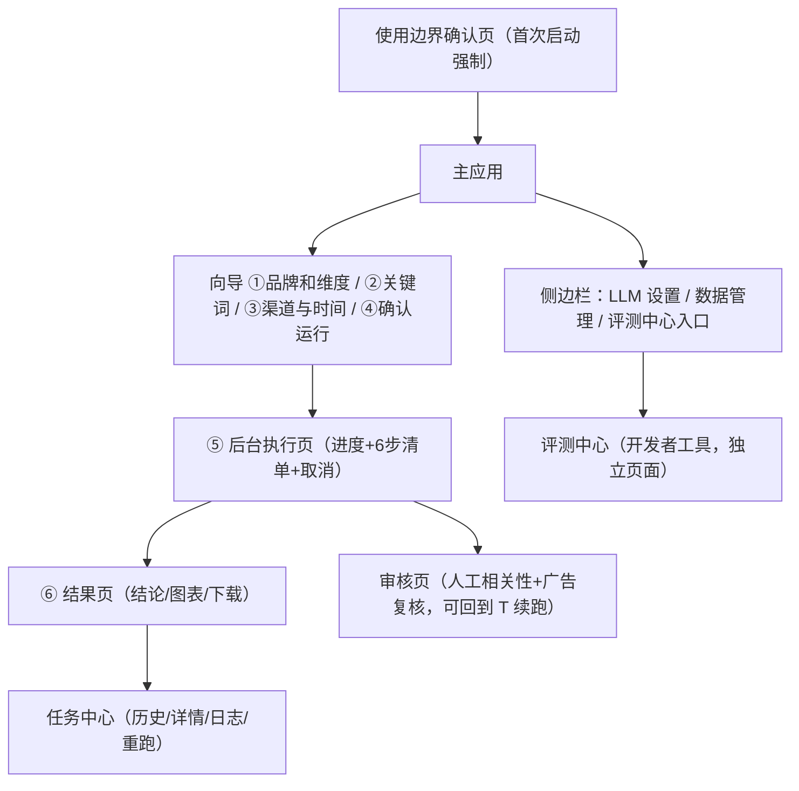
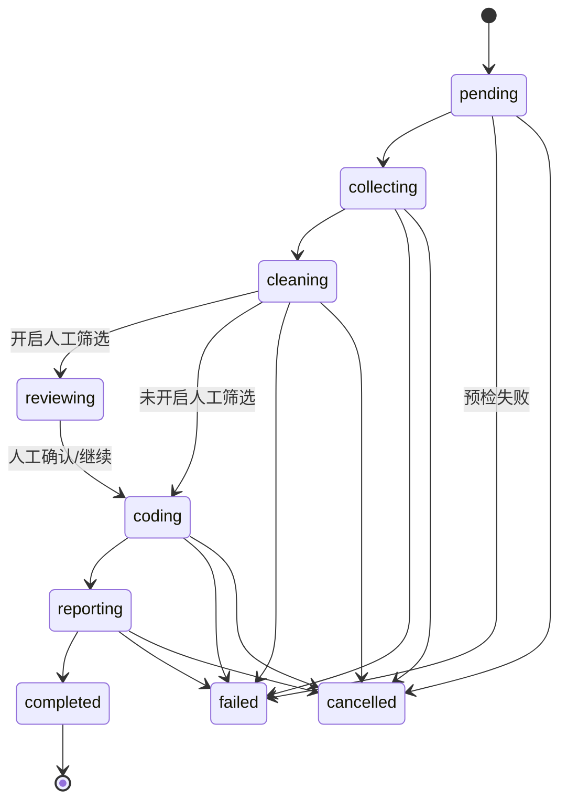

# 项目开发全景：需求 → 原型 → 前端 → 后端 → 测试

> 本文把项目的完整开发脉络整理为五段：① 需求澄清 → ② PRD+原型 → ③ 前端实现 →
> ④ 后端逻辑 → ⑤ 自动化测试与回归验证。所有内容均取自仓库实际代码与文档
> （事实源以代码/测试为准），供新开发者或 AI 助手按此顺序理解项目并继续开发。
> 配套：[PRD](PRD.md) · [技术方案](技术方案.md) · [复用与规则](复用与规则.md) ·
> [决策日志](决策日志.md) · [评测记录](评测记录.md)

---

## ① 需求澄清

### 1.1 用户是谁

目标用户（来自 [BRD](BRD.md) §3，画像基于项目场景假设，待内测回填）：

| 画像 | 特征 | 核心诉求 |
|---|---|---|
| 个人创作者 / 博主 | 需要了解粉丝与平台口碑，预算低 | 便宜、简单、单次够用 |
| 小团队 / 初创（3–10 人） | 做新品/竞品调研，无专职舆情岗 | 快速出报告、可导出、成本可控 |
| 品牌方市场人员 | 日常/专项舆情分析 | 可信、可追溯、合规 |

当前主场景（已覆盖）：**新品口碑评估**（产品经理在发布后做一次完整评估）与
**热点事件复盘和归因**（部分覆盖）；持续监控/告警不在当前范围。

### 1.2 核心问题

市场验证过的四类痛点（[BRD](BRD.md) §1）：

1. **商业舆情 SaaS 门槛高**：年费数万至数十万，面向企业采购，个人和小团队用不起；
2. **人工方案不可持续**：手动搜索 + Excel 整理，耗时且主观；
3. **数据与隐私顾虑**：云端 SaaS 需上传账号凭据/内容，敏感用户顾虑大；
4. **质量不透明**：多数工具不公布准确率，结论不可追溯。

**一句话定位**：小白也能上手的本地桌面级**单次**社交媒体情感分析工具——
输入品牌/关键词 → 输出可分享的图表与分析报告。

### 1.3 边界条件

| 维度 | 边界 |
|---|---|
| 范围 | 单次分析闭环（采集→清洗→编码→报告）+ 后台任务 + 数据管理 + 评测中心 |
| 不做 | 持续监控/告警/多期对比、打包分发、网页版、抖音渠道（均有明确延后决策） |
| 合规 | 仅用于合规个人分析与学习；渠道凭据用户自备；内置采集上限与风控冷却；无绕过平台防护技术 |
| 隐私 | 默认本地离线；开启 LLM 才发送低置信文本（发送前脱敏）；Key/Cookie DPAPI 加密存本机 |
| 数据 | `data/` 不入库；评测集为脱敏版（链接/@/邮箱/手机号/身份证已替换为占位符） |
| 平台 | Python 3.10+（实测 3.13）；Windows 完整支持（DPAPI/词云字体）；macOS 部分能力降级 |
| 质量门槛 | 一键回归 38 项全绿 + 黄金集词典基线不跌破 1pp |
| 许可 | AGPL-3.0（个人学习/研究自由；商用遵守其条款） |

---

## ② PRD + 原型

完整 PRD 见 [PRD.md](PRD.md)（v1.0）。以下为核心结构摘要。

### 2.1 产品范围与功能清单

优先级：P0=核心闭环 / P1=体验与质量 / P2=增强。

| 模块 | 核心功能（全部 ✅ 已实现） | 优先级 |
|---|---|---|
| 向导 | 六步向导、模块/维度多选组合、计划复用/一键重跑 | P0/P1 |
| 渠道 | 注册表 + 演示/B站/WebSearch/微博/小红书、配额/暂停/风控冷却、采集透明度 | P0/P1 |
| 编码 | 清洗去重脱敏、词典预筛 + LLM 精分析、维度级情感、人工相关性筛选、need_review 闭环 | P0/P1 |
| 报告 | Excel 5 sheet、HTML 交互报告、Word 报告、证据链发现、准确率明示、演示报告 | P0/P1 |
| 任务 | 后台队列/进度/取消、历史回看/详情/日志、崩溃恢复 | P0 |
| 数据 | 数据管理（归档/清理/磁盘）、一键清除 | P1 |
| 评测 | 评测中心（跑分/维度/关键词效果/错误下钻） | P1 |
| 合规 | 使用边界确认、LLM 出境提示、导出合规提示 | P0/P1 |
| 反馈 | 结果页反馈闭环（入口→处理→回执） | P1 |

待做（P2）：产品埋点（本地 JSONL）、内测反馈驱动候选需求。

### 2.2 页面结构（页面清单）



| 页面 | 代码入口 | 关键内容 |
|---|---|---|
| 使用边界确认 | `app/main.py`（门禁） | 《使用边界》全文 + 勾选 + 确认（版本变化重确认） |
| 向导 ① 品牌和维度 | `app/ui/wizard.py: render_stage0` | 复用旧计划 / 模块多选 / 维度多选 / 自定义维度 |
| 向导 ② 关键词 | `render_stage1` | 维度驱动关键词建议 + 手输/删除 |
| 向导 ③ 渠道与时间 | `render_stage2` | 渠道多选、配额/冷却状态、Cookie 粘贴、关键词优化、渠道诊断、WebSearch 设置、上限滑块 |
| 向导 ④ 确认运行 | `render_stage3` | 计划摘要、费用预估、demo-only 红色确认、启动/返回 |
| ⑤ 后台执行 | `app/ui/tasks.py: render_running` | 整体进度条 + 6 步清单（collect/clean/lexicon/llm/narrative/report）+ 取消 |
| ⑥ 结果页 | `app/ui/results.py: render_results` | 结论胶囊 + 指标卡 + 图表钻取 + 下载区 + 需复核清单 + 反馈 |
| 审核页 | `results.py: _render_review_view` | 帖子/评论二级结构逐条剔除，LLM 建议徽标，广告复核 |
| 任务中心 | `tasks.py: render_task_center` | 分页列表、详情、日志、一键重跑 |
| 侧边栏 | `app/ui/sidebar.py` | LLM 设置（DPAPI 保存）、数据管理、开发者模式 |
| 评测中心 | `app/eval_dashboard.py` | 概览/细分跑分/情感表现/维度情感/运行对比/错误下钻/关键词效果/策略配置/运行历史/用户反馈 |

### 2.3 交互流程

**主流程**：① 填品牌+选维度 → ② 核对关键词 → ③ 选渠道/时间/上限 → ④ 看摘要确认启动
→ ⑤ 后台执行（关页面不中断）→ ⑥ 结果页查看/下载。

**关键交互规则**：

| 交互 | 规则 |
|---|---|
| 步骤前进/后退 | 每步本地校验（品牌非空、维度 ≥1 且 ≤10、关键词非空、渠道 ≥1） |
| 提交防重 | 提交守卫防重复入队 |
| 一键重跑 | 复用原计划直接入队，不经 ④ 确认页 |
| 进度轮询 | 前端轮询 SQLite，阶段进度单调不回退，1 秒节流写库 |
| 取消 | 任意阶段可用；采集阶段立即停，其余阶段跑完当前批次后不落输出 |
| 人工筛选 | 任务在清洗后暂停进审核页，逐条剔除后继续分析 |
| 需复核闭环 | 结果页标记难例 → 人工确认/反馈 → 报告按复核结果规则重算（可再生成 LLM 深度结论） |
| 凭据失效 | 微博 Cookie 过期 → 弹窗重粘后返回重试 |

**异常分支**（详见 PRD §2.2）：凭据失效、风控冷却、采集不足、LLM 失败降级词典、任务失败
（步骤/原因/建议 + 日志 + 一键重跑）、零数据短路（不调 LLM 不出推断）、用户取消（配额/费用回退）。

### 2.4 原型资产

`design_entries/ui-designer/` 保存了写代码前定稿的原型：

| 资产 | 用途 |
|---|---|
| `prototype_app.html` | 向导主界面原型 |
| `prototype_report.html` / `prototype_result.html` | 报告/结果页原型 |
| `design_tokens.css` | 设计令牌（色板/字体/圆角），与 `app/ui/global.css`、`theme.py` 同源 |
| `streamlit_config.toml` / `streamlit_global.css` | 移植到 Streamlit 的配置与样式 |
| `AGENT_PROMPT.md` / `HANDOFF.md` / `README.md` | 原型设计交接与评审记录 |

> 约定：**改流程先改图**——页面/交互变更先更新原型图，图和代码一起过评审（决策日志约定）。

---

## ③ 前端实现

### 3.1 技术栈与入口

- Streamlit（>=1.60）+ Plotly（图表，HTML 离线内嵌）+ 自研 CSS 主题注入；
- 单页应用入口 `app/main.py`：全局 CSS → 使用边界门禁 → 生命周期修复 → 侧边栏 →
  任务中心 → 按 `stage` 分发（0–3 向导 / 4 执行 / 5 结果）；
- UI 全部拆到 `app/ui/`：`wizard / tasks / results / sidebar / theme / constants / dev`。

### 3.2 页面结构（实现映射）

| 视图 | 实现函数 | 说明 |
|---|---|---|
| 向导 | `render_wizard()` → `render_stage0..3()` | 每步独立渲染 + 本地校验 + `next_stage/prev_stage` |
| 执行页 | `render_running()` | `st.progress` + 6 步清单（`STEP_DEFS`）+ 取消按钮 |
| 结果页 | `render_results()` | 结论胶囊（HTML）、指标卡、图表、下载、复核、反馈 |
| 任务中心 | `render_task_center()` / `_render_task_detail()` | 列表/详情/日志（`_render_task_logs`） |
| 侧边栏 | `render_sidebar()` | LLM 设置 / 数据管理 / 开发者模式 |
| 评测中心 | `app/eval_dashboard.py: main()` | `st.tabs` 七个页签 |

### 3.3 交互逻辑

- **会话状态**：`st.session_state.stage` 驱动页面流转；`_apply_restored_widgets()` 恢复已提交计划的控件值（免重填）；
- **校验前置**：关键词空、维度超上限、渠道为空等都在前端拦截并给出中文错误；
- **提交链路**：④ 确认 → `planner.build_plan` → `jobs.submit_task` 入队 → 跳转 stage 4；
- **进度消费**：`render_running` 轮询任务表（progress_frac/message/step_snapshot），worker 未运行时提供"启动后台进程"按钮；
- **结果回读**：`open_task_result()` 读取 `result.json` 反序列化为 `ReportBundle`；
- **复核/反馈**：`apply_need_review_feedback` + `rebuild_report_after_review`（复核后总是规则重算，可再生成 LLM 深度结论）；
- **演示报告**：侧边栏可一键查看内置演示（云朵咖啡），无 Key 也能体验全流程。

### 3.4 可视化

结果页图表（Plotly，全部离线内嵌）：

| 图表 | 数据源 | 展示 |
|---|---|---|
| 整体情感主图 | summary.sentiment_distribution | 结论视图唯一默认展开 |
| 各平台情感分布 | platform_stats | 结论视图折叠、全部视图展开 |
| 时间趋势（跨度>90 天按周聚合） | trend | 同上 |
| 情绪强度分布 | intensity_counter | 同上 |
| 维度分析（3 图组） | dim_stats | 负面率条形 / 平台×维度热力图 / 雷达 |
| 平台 × 维度负面率 | platform_dim | 折叠钻取 |
| 高频情感词 Top20 | 词典极性 × 情感分加权 | 折叠 |
| 情感词云（正/负/最差维度） | 情感信号 × 词频 | 按需生成 |
| 共现网络 / 话题簇 | PMI 加权 + Louvain | 小样本自动降级为词对榜 |

结果页视觉结构：结论胶囊（含数据量/时间窗/待复核可信度）→ 4 张指标卡
（整体倾向/平均分/帖子数/编码文本数）→ 采集说明 → 方法分布 → 需复核清单 →
图表区 → 下载区（Excel/HTML/Word/JSON）→ 反馈入口。

### 3.5 可视化验证

- **原型对照**：实现与 `design_entries/ui-designer/` 原型逐项对照（结论胶囊/指标卡/主图唯一展开/折叠钻取）；
- **演示任务**：`demo` 渠道确定性数据，用于验证全链路渲染与小白首跑；
- **评测中心**：`eval.bat` 打开，黄金集按渠道/领域/情感类别/语言现象细分跑分、混淆矩阵、
  错误样本下钻、两次运行对比——既是质量工具也是前端可视化验证；
- **回归仪表盘**：`tests/run_regression.py` 输出 `data/regression/<ts>/report.json` 供趋势核对。

---

## ④ 后端逻辑

### 4.1 数据结构

**内存模型（Pydantic v2，`app/core/models.py`）**：

| 模型 | 职责 | 关键字段 |
|---|---|---|
| `AnalysisPlan` | 一次分析的采集计划 | subject/domain_id/dimensions/keywords/channels/date 窗/per_keyword_limit/llm 开关/review 开关 |
| `Post` / `Comment` | 统一帖子与评论 | 渠道/作者/标题/正文/url/时间/点赞/ad_flag/platform_specific |
| `ChannelResult` | 单渠道采集结果 | ok/posts/dropped/collection_stats/warnings/degraded/risk |
| `CodedItem` | 每条文本编码结果 | sentiment/intensity/score/confidence/method/维度级情感/narrative/attribution/ad_flag/need_review |
| `ReportBundle` | 完整报告 | plan/channel_results/coded_items/summary/findings/evidence/insight_mode/llm_usage/warnings |
| `DomainSchema` | 领域维度 schema | domain_id/dimensions/version/template_fingerprint |

**持久化（SQLite `data/app.db`，`app/core/jobs.py`）**：

| 表 | 用途 | 关键列 |
|---|---|---|
| `tasks` | 任务主表 | status/plan/progress_frac/message/step_snapshot/worker_id/heartbeat_at/cancel_requested/output_dir/result_summary/llm_usage/warnings/error/failed_step/files_status |
| `task_logs` | 任务级日志 | task_id/ts/level/step/event/message/detail |
| `worker_heartbeats` | worker 存活 | worker_id/started_at/heartbeat_at |
| `channel_state` | 渠道配额/风控 | channel_id/date/quota_used/quota_limit/paused/cool_until/backoff_level |

**落盘协议**：`result.json`（`pipeline.bundle_to_json`）= plan + channel_results + summary +
report_text + chart_insights + conclusion + findings + evidence + insight_mode + llm_usage +
warnings + coded_items。输出端只消费 `ReportBundle`，不自行重算统计。

### 4.2 API

本项目是本地桌面应用，**没有对外 HTTP API**；"接口层"分三类：

**① 应用内部函数 API（`app/core/jobs.py`，前后端共享）**：

| 函数 | 作用 |
|---|---|
| `submit_task / rerun_task / delete_task` | 任务生命周期入口 |
| `claim_next_task / update_task_progress / touch_task / finish_task / fail_task` | worker 执行接口 |
| `mark_cancelled / request_cancel / is_cancel_requested` | 取消协议 |
| `recover_stale_tasks` | 崩溃恢复（心跳超时 90s） |
| `save_review / list_task_logs` | 人工复核与日志 |
| `check_channel_allowed / consume_quota / refund_quota / settle_quota` | 配额预检/预扣/回填 |
| `pause_channel / resume_channel / set_cooldown / clear_cooldown / set_quota_limit` | 渠道管控 |

**② 外部服务接口**：

| 外部 | 接口 | 约束 |
|---|---|---|
| B站 | 公开 API（搜索/视频/评论） | 零登录；节流 4.5s±抖动；上限 50 |
| 微博 | 搜索/热评接口 | 用户 Cookie；风控即停；上限 30 |
| 小红书 | opencli（Chrome 登录态） | 只取顶层评论；上限 10 |
| WebSearch | 360 / cn.bing / 夸克 HTML | 验证码即停；引擎池轮换；每日关键词总量 24 |
| LLM | OpenAI 兼容 Chat Completions（DeepSeek/OpenAI） | 发送前统一脱敏；批 10 条并发 4 批 |

**③ 评测 CLI 接口**：`tests/benchmark_golden.py --llm / --golden ...`，复用同一管道与脱敏函数。

### 4.3 状态流转

**任务状态机**（`TaskStatus` + 管道实现）：



**阶段进度权重**：collecting 0–50% / cleaning 50–60% / coding 60–90% / reporting 90–100%，
单调不回退。

**渠道状态机**（`channel_state`）：每日配额（weibo 200 / xiaohongshu 100，预扣+回填）→
暂停/恢复 → 风控冷却（10min × 2^level，封顶 60min）→ 解除冷却。

**worker 心跳与恢复**：任务级 10s / worker 级 10s；启动时把心跳超时（90s）的 running
任务标记 failed；取消为尽力而为；代码版本变化自动重启 worker。

### 4.4 执行数据流

```
向导确认 → AnalysisPlan → submit_task(DB)
  → worker 抢单 → _prepare_channels（剔除不可用渠道+预扣配额）
  → 各渠道 collect() → ChannelResult
  → clean_posts（清洗/去重/脱敏）→ 可选 LLM 相关性复核 → 丢弃率>15% 补采（≤2 轮）
  → Coder：词典预筛 → 低置信送 LLM（脱敏）→ 维度级情感 → 可选叙事/归因
  → recompute_summary → build_evidence → build_findings → 报告文本
  → build_excel / build_html / build_word → result.json 落盘
  → finish_task（写回 output_dir/result_summary/files_status）
```

---

## ⑤ 自动化测试 & 回归验证

### 5.1 测试分层

| 层 | 载体 | 覆盖内容 |
|---|---|---|
| 单元测试 | `tests/test_*.py`（38 个，显式白名单） | 清洗/词典/维度/证据/报告/配额/生命周期/密钥/LLM 解析/UI 流/契约 |
| 契约测试 | `test_contracts.py` | 渠道注册表与领域 JSON schema 强制校验（新增渠道/领域不破坏系统） |
| UI 流测试 | `test_ui_flow.py` | Streamlit 向导/结果/任务中心关键路径（AppTest） |
| 评测基准 | `tests/benchmark_golden.py` | 黄金集/边界集词典直判 + 混合流水线跑分 |
| 验证纪律 | `test_validation_discipline.py` | hold-out 分层/冻结/次数上限/gold 修订过滤 |
| 真实验收 | `tests/manual_acceptance.py` | 渠道/关键词/报告证据链六条（需微博 Cookie，不进 CI） |

### 5.2 一键回归（防功能跑偏）

- `regress.bat` / `./regress.sh` ≡ `python tests/run_regression.py`；
- 流程：38 个单元测试（失败自动重跑 1 次降 flaky）→ 黄金集词典评测（硬门槛）→
  边界集词典（strict-edge A 档：只提示不设硬门槛）→ 可选混合/真实验收；
- 退出码：任一单元失败 / 词典基线跌破门槛 / 验收失败 → 1；
- 报告落盘 `data/regression/<ts>/report.json`，历史 `data/regression/history.jsonl`。

### 5.3 评测门槛（防 AI 改动破坏系统）

| 项 | 规则 |
|---|---|
| 词典基线 | `accuracy ≥ 基线 − 1.0pp`，跌破 FAIL，需 `--accept-baseline` 显式接受新基线并提交基线文件 |
| 混合（LLM） | 仅记录不设门槛（费用/凭据不进 CI） |
| 边界集 | 词典 A 档只提示 + 人工验收 |
| 指纹守卫 | golden 文件指纹、领域 schema 版本号变化 → 基线重冻结 |
| 统计口径 | 95% Wilson CI；Δ 判定宽度 = √(ci₁²+ci₂²)；n≥30 且 Δ 在 CI 内判「噪声内」 |
| 提准纪律 | 新样本 / 干净裁判 / 噪声感知 / 跨领域四道关；hold-out 冻结只读、使用 ≤2 次 |

### 5.4 CI（双平台回归）

`.github/workflows/ci.yml`：push/PR 触发，windows-latest + ubuntu-latest 双平台，
Python 3.13，`python tests/run_regression.py --ci`（禁写 docs / 禁验收 / 禁 LLM），
回归报告上传为 artifact。

### 5.5 AI 改动的防破坏机制（项目特有）

| 机制 | 作用 |
|---|---|
| 显式单元白名单 | 工具脚本/递归自检不会被误收录 |
| 契约测试 | 新增渠道/领域必须符合注册表与 schema 契约 |
| 冻结基线 + 指纹 | 词典准确率回退即红；样本/维度集变更强制重冻结 |
| 可回退规则开关 | `SMS_NEED_REVIEW_RULE`（v1/v2/v3）、`SMS_V34_RULES` 等环境变量保留旧路径 |
| 展示校准 | 词典直判置信度封顶 0.6（防误导），result.json 原始值不变 |
| 双模式兜底 | LLM 失败自动降级词典；零数据短路不产生推断 |
| 校验纪律 | LLM findings 必须逐条校验通过，否则整组丢弃降级为规则 findings |

---

## 附：按本流程继续开发的检查清单

1. **需求澄清**：先回答"用户/问题/边界"，把模糊需求落到三列（是谁/为什么/不做什么）；
2. **PRD+原型**：改流程先改 `design_entries/ui-designer/` 原型图，图和代码一起评审；
3. **前端**：在 `app/ui/` 对应模块实现，新指标同步补 `terms.py` tooltip；
4. **后端**：数据走 Pydantic 模型与 `jobs.py` 接口，输出端只消费 `ReportBundle.summary`；
5. **测试**：新增改动配套单测 + 契约更新，`regress.bat` 全绿且词典基线不破 1pp，再提交。
