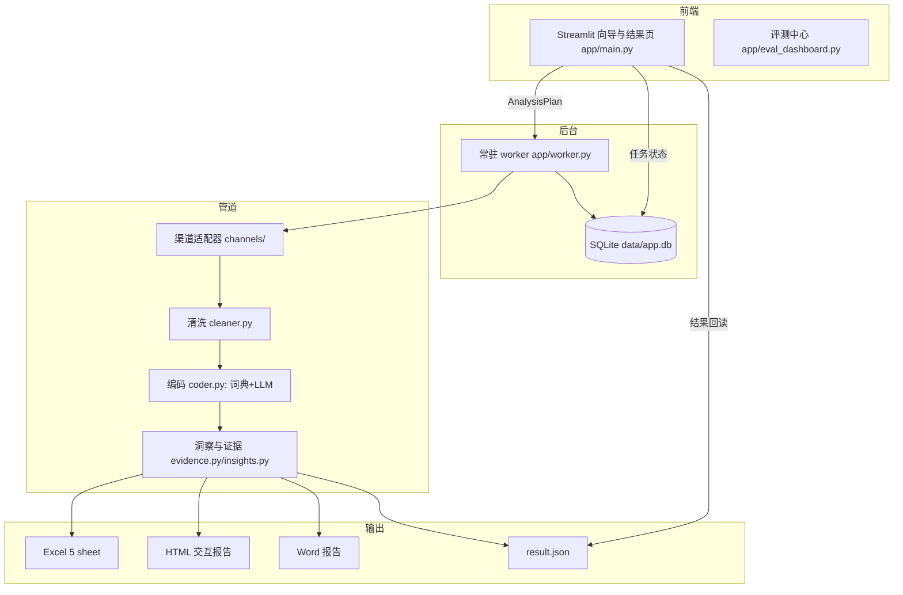
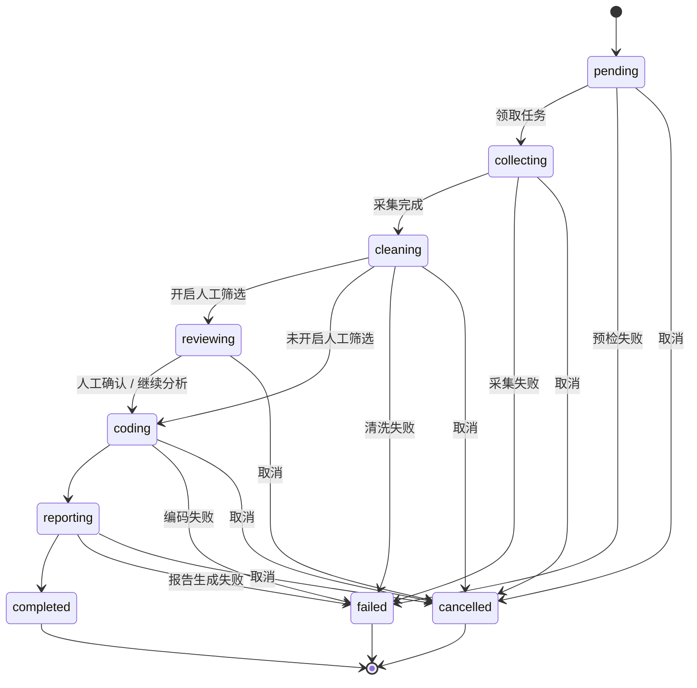
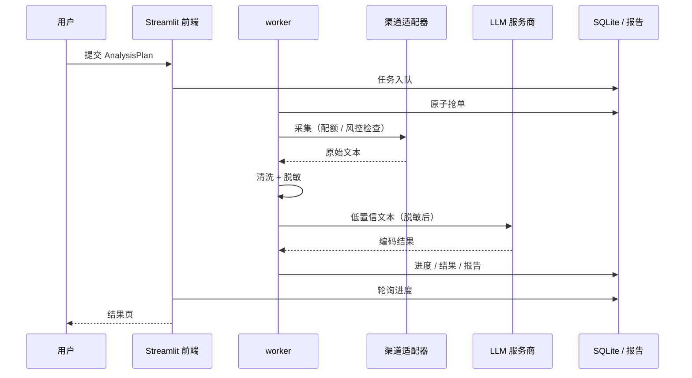

# 技术方案文档

> 版本：v1.0（2026-08-22）| 状态：待评审
> 配套：[PRD](PRD.md) · [项目方案](项目方案.md) · [决策日志](决策日志.md) · [评测记录](评测记录.md)
> 说明：本文件为技术实现的事实源；[项目方案.md](项目方案.md) 保留产品方案与历史规格，二者以本文件为准时冲突以代码与测试为准。

## 1. 总体架构

分层职责：Streamlit 前端负责向导/任务中心/结果渲染；worker 负责任务执行（采集→清洗→编码→报告）；SQLite 承载任务/进度/结果索引；渠道适配器以注册表模式接入；评测中心独立页面复用同一管道。

## 2. 技术栈

| 层 | 技术 | 版本约束 |
|---|---|---|
| 应用框架 | Streamlit | >=1.60 |
| 数据模型 | Pydantic v2 | >=2.7 |
| 数据处理 | pandas + openpyxl | pandas>=2.2 |
| 图表 | Plotly | >=5.22（HTML 离线内嵌） |
| Word | python-docx | >=1.1 |
| 图片渲染 | kaleido | >=1.0 |
| 分词 | jieba | >=0.42 |
| 词云 | wordcloud | >=1.9（中文字体 msyh.ttc） |
| 网络图 | networkx | >=3.0 |
| HTTP | requests | >=2.31 |
| LLM | OpenAI 兼容接口（DeepSeek 实测） | — |
| 密钥 | Windows DPAPI（本地） | — |

运行环境：Windows（词云字体路径）、Python 3.10+（实测 3.13）；`requirements.txt` 锁定。

## 3. 数据模型（Pydantic v2）

| 模型 | 职责 | 关键字段 |
|---|---|---|
| `AnalysisPlan` | 一次分析的采集计划 | 品牌/维度/关键词/渠道/时间窗/上限/LLM 开关 |
| `Post` | 统一帖子模型 | 渠道/作者/时间/正文/链接/采集元数据 |
| `CodedItem` | 每条文本编码结果 | 整条情感/强度/维度情感/置信度/need_review |
| `ReportBundle` | 完整报告 | summary/图表/证据/findings/结论/模式 |

`summary` 为图表、Excel、HTML、Word 共用的统一口径，避免各端各自算。

## 4. 核心模块设计

| 模块 | 文件 | 说明 |
|---|---|---|
| 渠道 | `app/channels/registry.py` + `base.py` | 注册表模式：demo/bilibili/websearch/weibo/xiaohongshu |
| 清洗 | `app/coding/cleaner.py` | 去重、脱敏（URL/@/邮箱/手机号/身份证）、标题壳页丢弃 |
| 词典编码 | `app/coding/lexicon_v2.py` | 预筛 + 维度轻量极性聚合；直判置信度封顶 0.6 |
| LLM 编码 | `app/coding/llm_analyzer.py` | 整条+维度情感、相关性复核、need_review；发送前统一脱敏 |
| 维度 | `app/coding/dimensions.py` + `app/domains/` | 领域 schema（content/physical/service）、组合合并规则 |
| 洞察 | `app/coding/insights.py` + `app/core/evidence.py` | 图表描述、证据级联、规则 findings、LLM 发现驱动结论 |
| 报告 | `app/output/` | excel_writer / html_report（Jinja2 模板）/ word_report |
| 任务 | `app/core/jobs.py` + `app/worker.py` | SQLite 任务表、原子抢单、心跳、崩溃恢复 |
| 生命周期 | `app/core/lifecycle.py` | 归档/清理/磁盘预检/进程互斥 |
| 评测 | `app/core/eval_store.py` + `tests/benchmark_golden.py` | 跑分历史、基线门槛、维度指标 |
| 密钥 | `app/core/secrets.py` | DPAPI 加解密，明文导入后删除 |

## 5. 关键机制

### 5.1 任务状态机

> 进度权重：collecting 0-50%、cleaning 50-60%、coding 60-90%、reporting 90-100%，单调不回退。
> 取消在任意阶段可用；重跑 = 复用原计划生成新任务（重新进入 pending），不是状态迁移（1.2）。

### 5.2 任务执行时序

- **渠道安全**：每日配额（预扣+回填/退款）、手动暂停、风控冷却 + 指数退避（10→20→40→60 分钟封顶）、一键解除；WebSearch 引擎池 360→bing→夸克、验证码即停。
- **密钥与隐私**：Key/Cookie 存 `data/secrets/`（DPAPI）；LLM 三入口发送前 `cleaner.desensitize_text`；默认离线。
- **质量门槛**：`tests/fixtures/baseline_lexicon.json` 词典基线，跌破 1pp 即 FAIL，`--accept-baseline` 显式接受；混合基线仅记录。
- **验证纪律**：提准类改动须过四道关（新样本/干净裁判/噪声感知/跨领域）；hold-out 卷冻结只读、≤2 次验收、判定需超出 95% CI。
- **关键词策略**：`app/channels/keyword_strategy.json`（同义词/额外查询/后缀池），WebSearch 自动展开；按渠道参数化（微博/小红书各自策略）。

## 6. 质量与测试

- 一键回归：`python tests/run_regression.py`（38 项，失败自动重跑 1 次），报告 `data/regression/<ts>/report.json`；
- CI：`.github/workflows/ci.yml`（windows + ubuntu，`--ci` 禁写 docs/禁验收/禁 LLM）；
- 评测中心：`eval.bat` → 黄金集按渠道/领域/情感类别/维度细分、错误下钻、关键词效果、改动类型引导；
- 契约测试：`test_contracts.py` 强制校验渠道注册表与领域 JSON schema。

## 7. 部署与运行

- 启动：双击 `run.bat`（自动装依赖 → 启动 worker → 打开浏览器 `http://localhost:8501`）；
- 命令行：`python -m streamlit run app/main.py`（worker 需另开 `python app/worker.py`）；
- 停止后台：双击 `stop_worker.bat`；
- 目录：`data/app.db`（任务库）、`data/reports/`（报告）、`data/logs/app.jsonl`（JSONL 轮转日志）、`data/secrets/`（密钥，gitignored）；
- 版本自检：worker 检测代码版本变化自动重启（1.9）。

## 8. 已知限制与扩展点

| 限制 | 现状 | 扩展方向 |
|---|---|---|
| 时间窗口 | 过滤器非回溯取数 | 定时增量采集（远期 3.2） |
| 小红书楼中楼 | opencli 仅顶层评论 | 渠道能力演进 |
| WebSearch 无评论抓取 | TapTap No-Go / 知乎需登录态（2.10） | 不立项 |
| 抖音 | 未接入 | 延后，需受控预研 |
| 打包分发 | 未打包 | 作品集阶段延后（4.1） |
| 网页版 | 混合形态设计（路线图） | 远期四步 |

## 9. 与既有文档的关系

- [PRD](PRD.md)：做什么/怎么验收（本文件的输入）；
- [项目方案.md](项目方案.md)：产品方案与历史规格（保留）；
- [决策日志.md](决策日志.md)：为什么这么做（唯一历史档案）；
- [评测记录.md](评测记录.md)：跑分明细（benchmark 自动维护）。